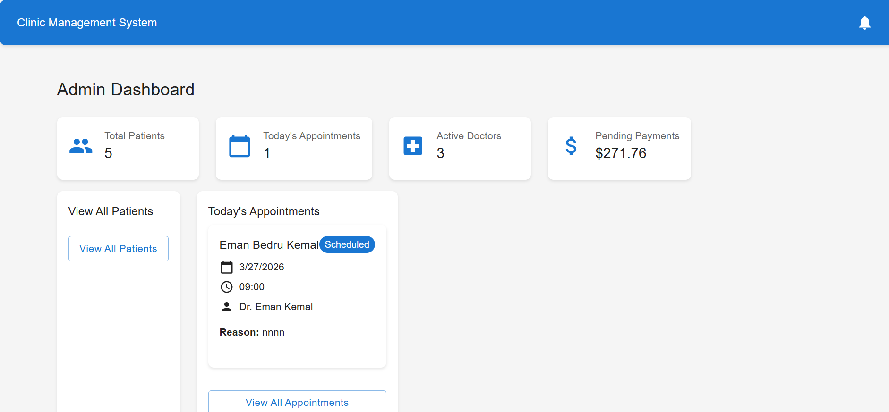
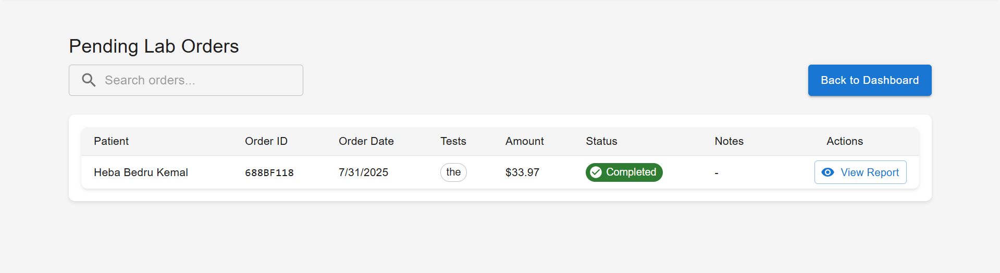

🏥 Hospital EMR System

A full-stack Electronic Medical Records (EMR) system developed independently to manage complete hospital workflows including patient registration, consultations, laboratory operations, and financial tracking.

---

🚀 Live Demo

🔗 (Add your deployed link here)

---

📌 Overview

This system enables hospitals to manage patients, staff, and medical processes efficiently through role-based access and structured workflows.

---

✨ Key Features

* 🔐 **Role-based access control** (Admin, Doctor, Receptionist, Lab Assistant, Patient)
* 🏥 **Patient management** with full medical history and diagnosis tracking
* 📅 **Appointment system** for scheduling and workflow management
* 🧪 **Laboratory module** for test requests and results
* 💰 **Financial tracking** for services and procedures
* 📄 **Medical reports** generation

---

🛠 Tech Stack

* React, Tailwind CSS
* Node.js, Express.js
* MongoDB
* JWT Authentication

---

👨‍💻 My Contribution

* Built the system independently from backend to frontend
* Designed RESTful APIs and database schema
* Implemented authentication and role-based authorization
* Developed core workflows for patient, appointment, and lab systems

---

📸 Screenshots

🖥️ Dashboard

👤 User Management

📅 Appointments

🧪 Lab Records

---

🚧 Status

Actively improving and deploying for public access.
